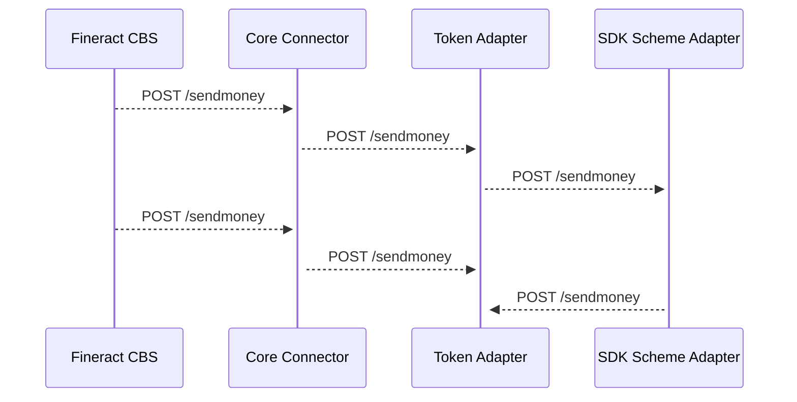

# Mifos Core Connector Development Docs

### Deploying and setting up fineract for development
To setup fineract for development, you will need to do following
- Deploy an instance of mariadb
- Deploy fineract with some environment variables set
- Use postman to create a Parent
- Create an Office
- Create a Group
- Create a Client

