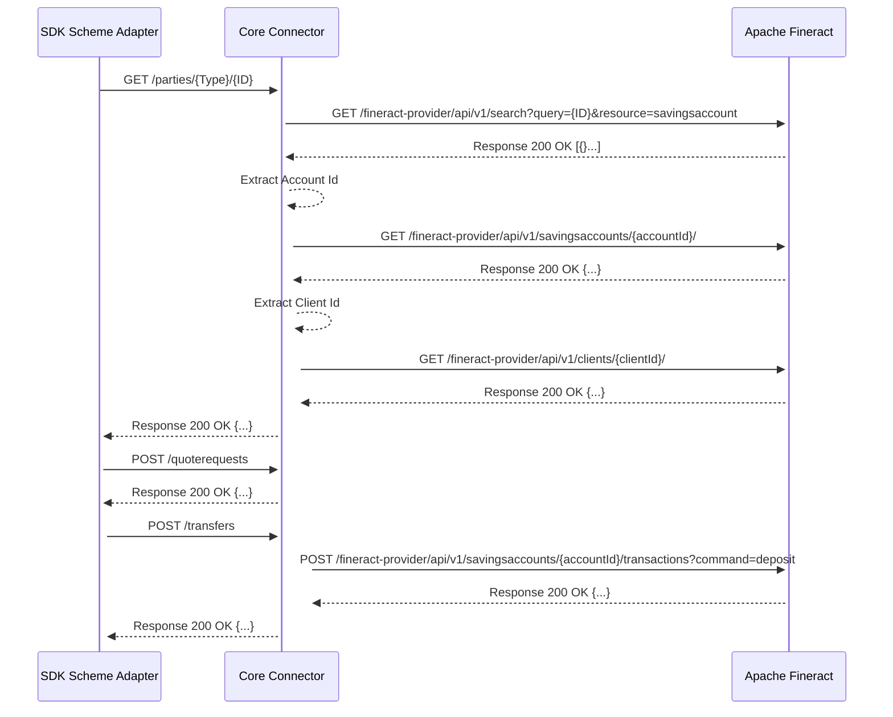

# Mifos Core Connector for Mojaloop Development Docs 

> The term fineract and Mifos are used interchangeably in this documentation to mean the same thing.

# Overview
This documentation is an account of the experience I had while developing the mifos core connector. The idea is to make sure the steps of how I got everything working and testing is documented and can easily be referenced for someone else to use. 


# Deploying and setting up fineract for development
To setup fineract for development, you will need to do following.

# Prerequisites

The following are required for you to successfully go through this documenation.
- Working knowledge of [docker](https://docs.docker.com/)
- Docker installed on your machine


## Deploy mariadb
Fineract uses mysql as it's default database management system. You will need to deploy an instance of mariadb on your localhost to be able to run fineract successfully.

Run this command to run a local instance of mariadb. Note the parameter `-e MARIADB_ROOT_PASSWORD=mysql` which sets the password for the mariadb instance.

```bash
docker run --name mariadb-11.2 -p 3306:3306 -e MARIADB_ROOT_PASSWORD=mysql -d mariadb:11.2
```

After running this command, you will have a local running instance of mariadb.

## Setup database
Fineact requires some database resources to be in place for it to start successfully.

Clone the fineract repository on your local machine and cd into the repo folder.

```bash
git clone https://github.com/apache/fineract.git; cd fineract
```

After cloning the repository, please execute the following commands at the root of fineract repo folder to create the database resources.

```bash
./gradlew createDB -PdbName=fineract_tenants
```

```bash
./gradlew createDB -PdbName=fineract_default
```

After running these commands, if they executed successfully, the database resources will be created and now we can proceed to run fineract.

## Deploy fineract
After you have deployed an instance of mariadb and created the database resources, you can then deploy the latest stable release of Apache Fineract from Docker Hub.

Run this command to deploy fineract locally.

```bash
docker run --name fineract -p 8443:8443 -p 8080:8080  -e FINERACT_DEFAULT_TENANTDB_PWD=mysql -e FINERACT_DEFAULT_TENANTDB_HOSTNAME=localhost -e FINERACT_SERVER_SSL_ENABLED=false --network="host" apache/fineract
```

# Existing public fineract instances 

There are existing public instances of Apache fineract hosted and maintained by [Mifos Initiative](https://www.mifos.org)

Here is one I used for the development and validation of my api routes 
- [https://demo.mifos.io/](https://demo.mifos.io/)

You can make requests to this base url while referring to the api docs at [Docs](https://demo.mifos.io/api-docs/apiLive.htm)


# Testing with Postman.

I have included in this repository a postman collection which you can use to test as I did during the development of this core connector.

# Fineract Core Connector Sequence Diagram

