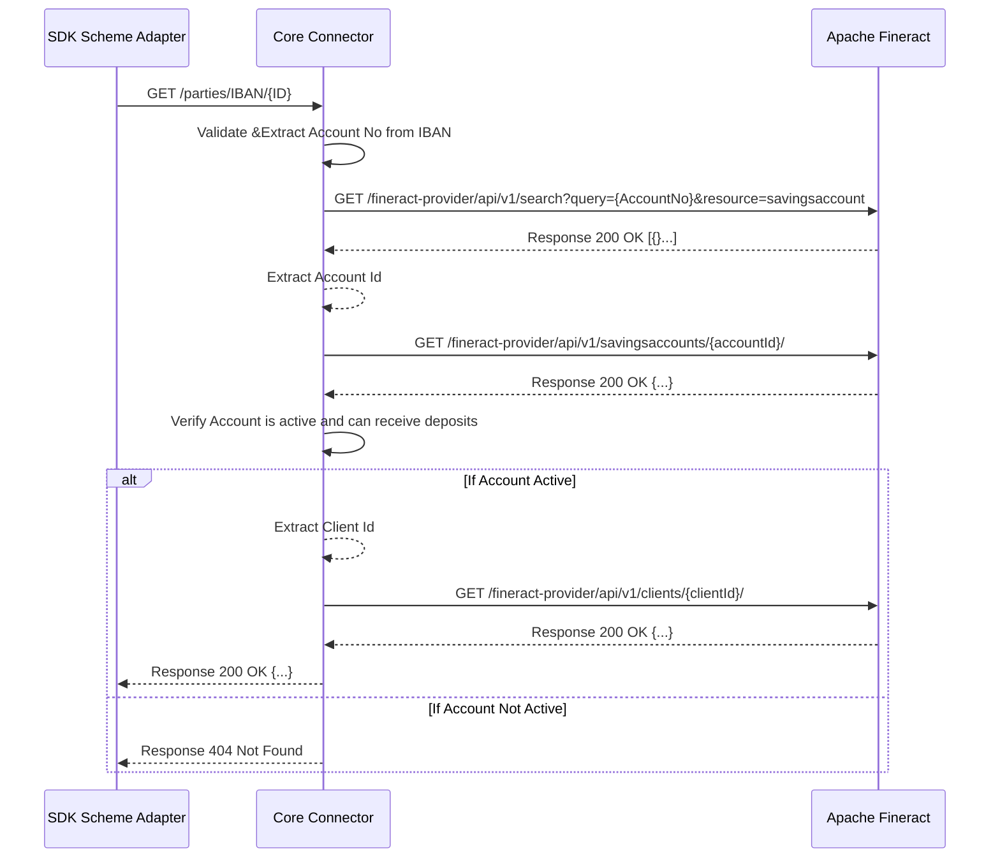

Payee Get Parties sequence diagram

```mermaid
sequenceDiagram
    SDK Scheme Adapter->>Core Connector: GET /parties/IBAN/{ID}
    Core Connector->>Core Connector: Validate &Extract Account No from IBAN
    Core Connector->>Apache Fineract: GET /fineract-provider/api/v1/search?query={AccountNo}&resource=savingsaccount
    Apache Fineract-->>Core Connector: Response 200 OK [{}...]
    Core Connector-->>Core Connector: Extract Account Id
    Core Connector->>Apache Fineract: GET /fineract-provider/api/v1/savingsaccounts/{accountId}/
    Apache Fineract-->>Core Connector: Response 200 OK {...}
    Core Connector->>Core Connector: Verify Account is active and can receive deposits
    Alt If Account Active
    Core Connector-->>Core Connector: Extract Client Id
    Core Connector->>Apache Fineract: GET /fineract-provider/api/v1/clients/{clientId}/
    Apache Fineract-->>Core Connector: Response 200 OK {...}
    Core Connector-->>SDK Scheme Adapter: Response 200 OK {...}
    Else If Account Not Active
    Core Connector-->>SDK Scheme Adapter: Response 404 Not Found
    End
```
