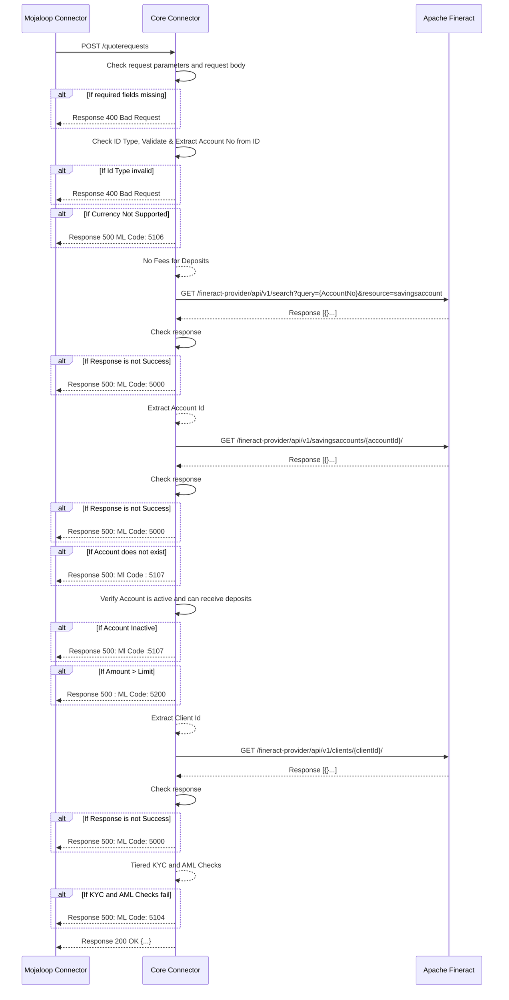

# Payee Quote Request 

```mermaid
sequenceDiagram
    Mojaloop Connector->>Core Connector: POST /quoterequests
    Core Connector ->> Core Connector: Check request parameters and request body
    Alt If required fields missing
    Core Connector-->>Mojaloop Connector: Response 400 Bad Request
    End
    Core Connector->>Core Connector: Check ID Type, Validate & Extract Account No from ID
    Alt If Id Type invalid
    Core Connector-->>Mojaloop Connector: Response 400 Bad Request
    End
    Alt If Currency Not Supported
    Core Connector -->> Mojaloop Connector: Response 500 ML Code: 5106
    End
    Core Connector-->>Core Connector: No Fees for Deposits
    Core Connector->>Apache Fineract: GET /fineract-provider/api/v1/search?query={AccountNo}&resource=savingsaccount
    Apache Fineract-->>Core Connector: Response [{}...]
    Core Connector ->> Core Connector: Check response
    Alt If Response is not Success
    Core Connector -->> Mojaloop Connector: Response 500: ML Code: 5000
    End
    Core Connector-->>Core Connector: Extract Account Id
    Core Connector->>Apache Fineract: GET /fineract-provider/api/v1/savingsaccounts/{accountId}/
    Apache Fineract-->>Core Connector: Response [{}...]
    Core Connector ->> Core Connector: Check response
    Alt If Response is not Success
    Core Connector -->> Mojaloop Connector: Response 500: ML Code: 5000
    End
    Alt If Account does not exist
    Core Connector -->> Mojaloop Connector: Response 500: Ml Code : 5107
    End 
    Core Connector->>Core Connector: Verify Account is active and can receive deposits
    Alt If Account Inactive
    Core Connector -->> Mojaloop Connector: Response 500: Ml Code :5107
    End
    Alt If Amount > Limit
    Core Connector -->> Mojaloop Connector: Response 500 : ML Code: 5200
    End
    Core Connector-->>Core Connector: Extract Client Id
    Core Connector->>Apache Fineract: GET /fineract-provider/api/v1/clients/{clientId}/
    Apache Fineract-->>Core Connector: Response [{}...]
    Core Connector ->> Core Connector: Check response
    Alt If Response is not Success
    Core Connector -->> Mojaloop Connector: Response 500: ML Code: 5000
    End 
    Core Connector-->>Core Connector: Tiered KYC and AML Checks 
    Alt If KYC and AML Checks fail
    Core Connector-->> Mojaloop Connector: Response 500: ML Code: 5104
    End
    Core Connector-->>Mojaloop Connector: Response 200 OK {...}
```
