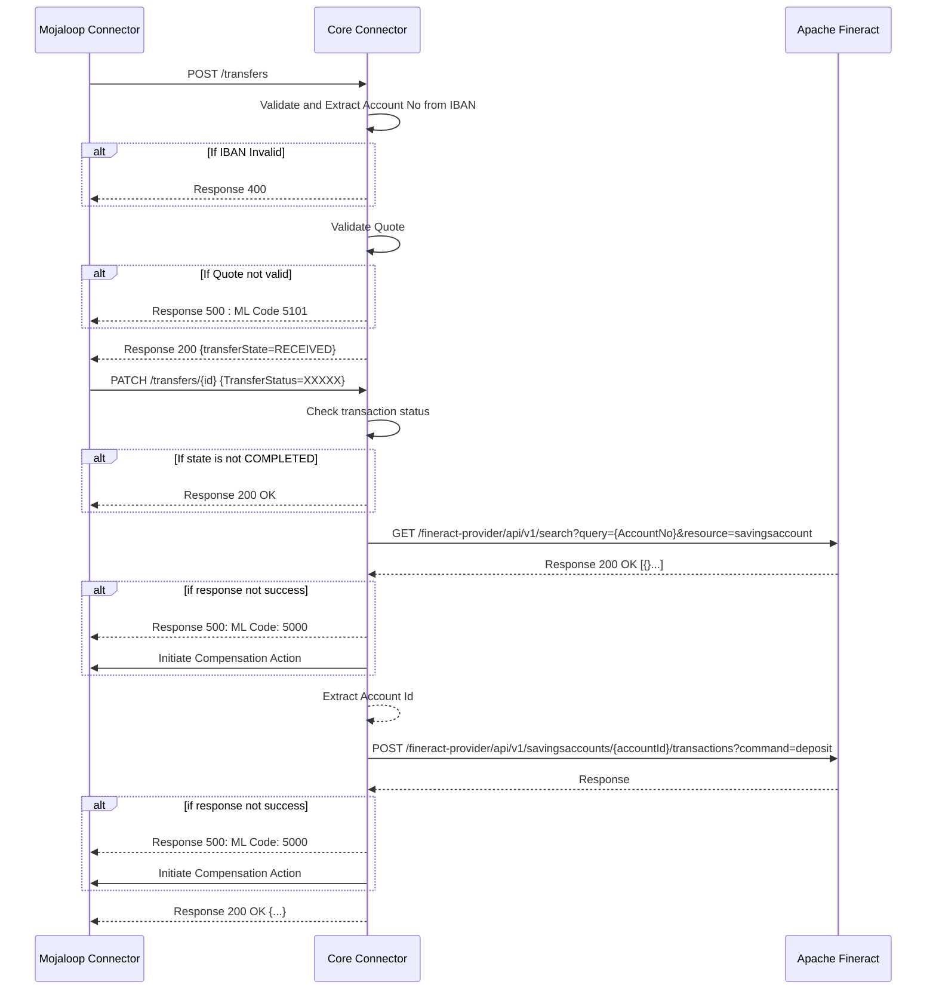

# Payee Transfers Request Sequence Diagram

Single Integration

```mermaid
sequenceDiagram
    Mojaloop Connector->>Core Connector: POST /transfers
    Core Connector->>Core Connector: Validate and Extract Account No from IBAN
    Alt If IBAN Invalid
    Core Connector-->> Mojaloop Connector: Response 400
    End
    Core Connector->> Core Connector: Validate Quote
    Alt If Quote not valid
        Core Connector -->> Mojaloop Connector: Response 500 : ML Code 5101
    End
    Core Connector -->> Mojaloop Connector: Response 200 {transferState=RECEIVED}
    Mojaloop Connector ->> Core Connector : PATCH /transfers/{id} {TransferStatus=XXXXX}
    Core Connector ->> Core Connector: Check transaction status
    Alt If state is not COMPLETED
    Core Connector -->> Mojaloop Connector: Response 200 OK
    End
    Core Connector->>Apache Fineract: GET /fineract-provider/api/v1/search?query={AccountNo}&resource=savingsaccount
    Apache Fineract-->>Core Connector: Response 200 OK [{}...]
    Alt if response not success
    Core Connector -->> Mojaloop Connector: Response 500: ML Code: 5000
    Core Connector ->> Mojaloop Connector: Initiate Compensation Action
    End
    Core Connector-->>Core Connector: Extract Account Id
    Core Connector->>Apache Fineract: POST /fineract-provider/api/v1/savingsaccounts/{accountId}/transactions?command=deposit
    Apache Fineract-->>Core Connector: Response
    Alt if response not success
    Core Connector -->> Mojaloop Connector: Response 500: ML Code: 5000
    Core Connector ->> Mojaloop Connector: Initiate Compensation Action
    End
    Core Connector-->>Mojaloop Connector: Response 200 OK {...}
    
```
