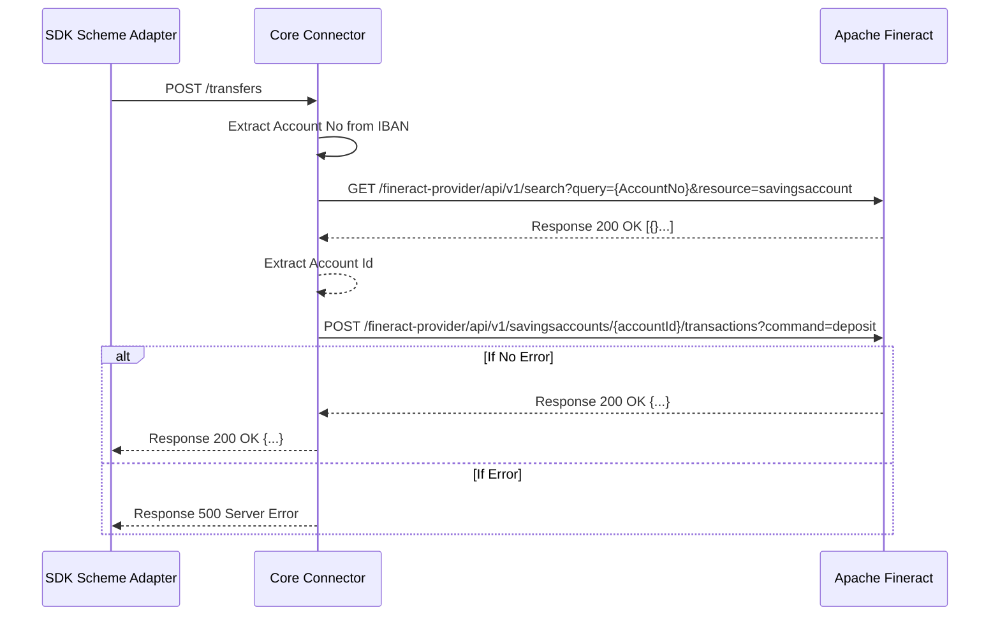

# Payee Transfers Request Sequence Diagram

```mermaid
sequenceDiagram
    SDK Scheme Adapter->>Core Connector: POST /transfers
    Core Connector->>Core Connector: Extract Account No from IBAN
    Core Connector->>Apache Fineract: GET /fineract-provider/api/v1/search?query={AccountNo}&resource=savingsaccount
    Apache Fineract-->>Core Connector: Response 200 OK [{}...]
    Core Connector-->>Core Connector: Extract Account Id
    Core Connector->>Apache Fineract: POST /fineract-provider/api/v1/savingsaccounts/{accountId}/transactions?command=deposit
    Alt If No Error
    Apache Fineract-->>Core Connector: Response 200 OK {...}
    Core Connector-->>SDK Scheme Adapter: Response 200 OK {...}
    Else If Error
    Core Connector-->>SDK Scheme Adapter: Response 500 Server Error
    End
```
