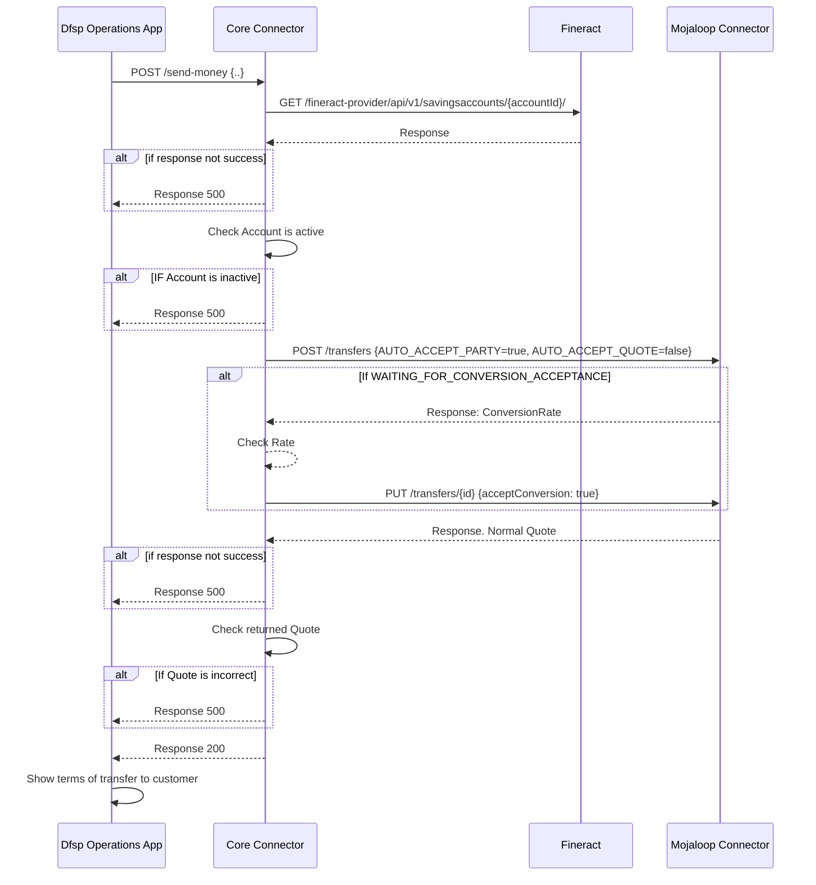

# Payer Send Money Request 

Initiate transfer

```mermaid
sequenceDiagram
    Dfsp Operations App->>Core Connector: POST /send-money {..}
    Core Connector->>Fineract: GET /fineract-provider/api/v1/savingsaccounts/{accountId}/
    Fineract-->>Core Connector: Response 
    Alt if response not success
    Core Connector -->> Dfsp Operations App: Response 500
    End
    Core Connector ->> Core Connector: Check Account is active
    Alt IF Account is inactive
    Core Connector -->> Dfsp Operations App: Response 500
    End
    Core Connector->> Mojaloop Connector: POST /transfers {AUTO_ACCEPT_PARTY=true, AUTO_ACCEPT_QUOTE=false}
    Alt If WAITING_FOR_CONVERSION_ACCEPTANCE
    Mojaloop Connector -->> Core Connector: Response: ConversionRate
    Core Connector -->> Core Connector: Check Rate
    Core Connector ->> Mojaloop Connector: PUT /transfers/{id} {acceptConversion: true}
    End
    Mojaloop Connector -->> Core Connector: Response. Normal Quote
    Alt if response not success
    Core Connector -->> Dfsp Operations App: Response 500
    End
    Core Connector ->> Core Connector: Check returned Quote
    Alt If Quote is incorrect
    Core Connector -->> Dfsp Operations App: Response 500
    End
    Core Connector -->> Dfsp Operations App: Response 200 
    Dfsp Operations App ->> Dfsp Operations App: Show terms of transfer to customer
    
```
