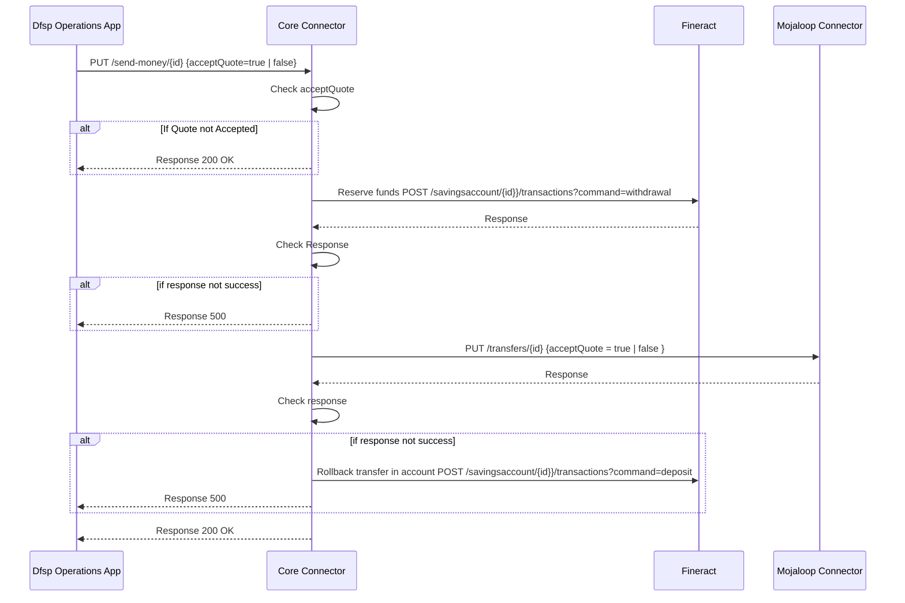

# Payer Send Money Request

Update transfer

```mermaid
sequenceDiagram
    Dfsp Operations App ->> Core Connector: PUT /send-money/{id} {acceptQuote=true | false}
    Core Connector ->> Core Connector: Check acceptQuote 
    Alt If Quote not Accepted
    Core Connector -->> Dfsp Operations App: Response 200 OK
    End
    Core Connector->> Fineract: Reserve funds POST /savingsaccount/{id}}/transactions?command=withdrawal
    Fineract-->> Core Connector: Response
    Core Connector ->> Core Connector: Check Response 
    Alt if response not success
    Core Connector -->> Dfsp Operations App: Response 500
    End
    Core Connector ->> Mojaloop Connector: PUT /transfers/{id} {acceptQuote = true | false }
    Mojaloop Connector -->> Core Connector: Response 
    Core Connector ->> Core Connector: Check response
    Alt if response not success
    Core Connector ->> Fineract: Rollback transfer in account POST /savingsaccount/{id}}/transactions?command=deposit
    Core Connector -->> Dfsp Operations App: Response 500 
    End
    Core Connector -->> Dfsp Operations App: Response 200 OK
    
```